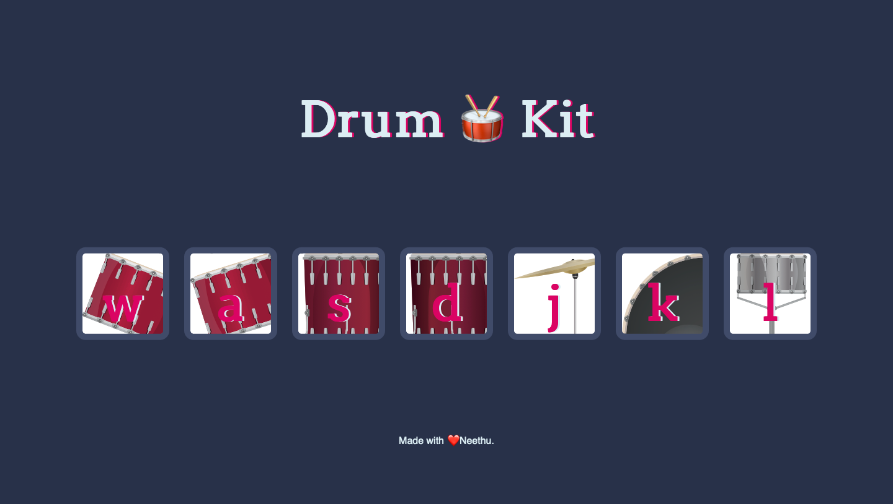

# Drum Kit

This is a challenge done as part of a Udemy course on Web development.

## Table of contents

- [Overview](#overview)
  - [The challenge](#the-challenge)
  - [Screenshot](#screenshot)
- [My process](#my-process)
  - [Built with](#built-with)
- [Links](#links)
- [Author](#author)

## Overview

### The challenge

The challenge is to build out an Advice Generator App using the [Advice Slip API](http://api.adviceslip.com) and get is looking as close to the design as possible.

Users should be able to:

- View the optimal layout for the app depending on their device's screen size
- See hover states for all interactive elements on the page
- Generate a new piece of advice by clicking the dice icon

### Screenshot

#### Desktop Design

### Links

- Live Site URL: [@nees101/Github]( https://nees101.github.io/Drum-Kit/)

## My process

### Built with

- Semantic HTML5 markup
- CSS custom properties
- Javascript

## Author

- Github - [@nees101](https://www.github.com/nees101)
